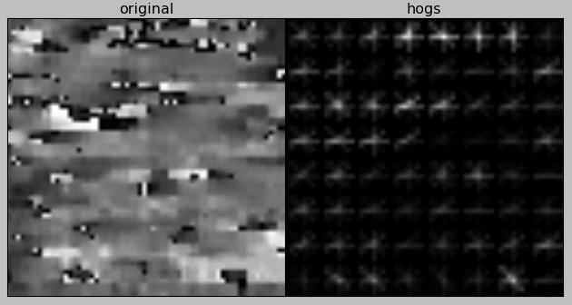
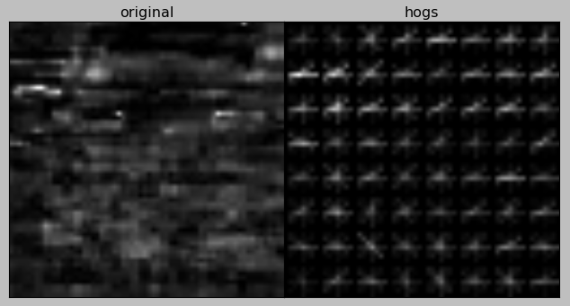
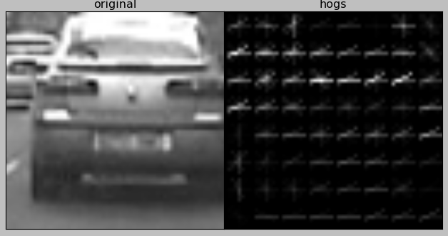
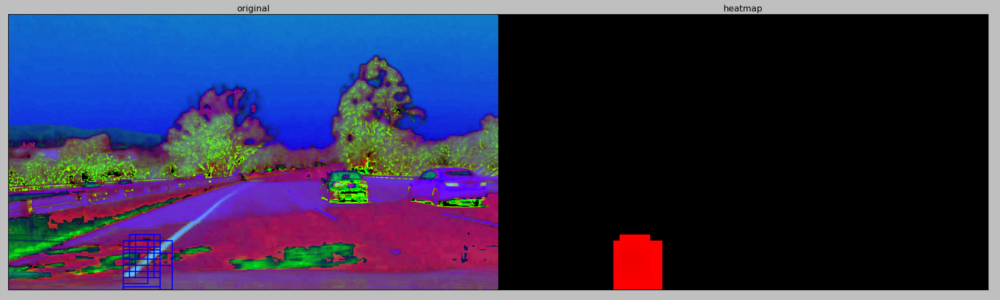
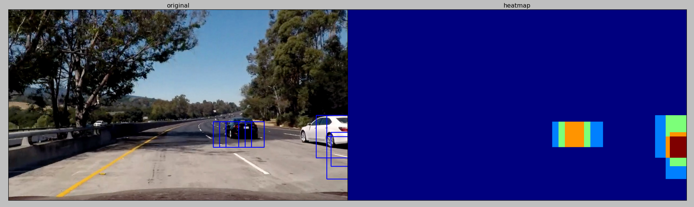
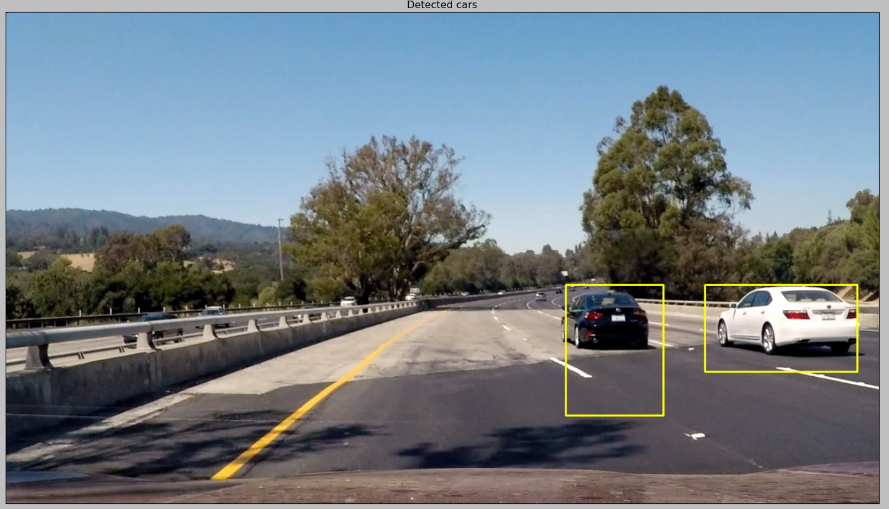
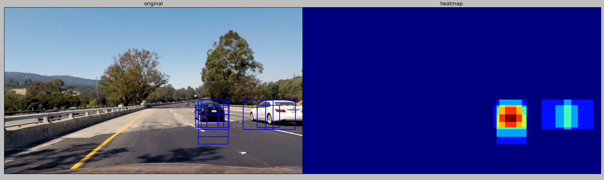

# Vehicle Detection
[](http://www.udacity.com/drive)

The Project
---

The goals / steps of this project are the following:

* Perform a Histogram of Oriented Gradients (HOG) feature extraction on a labeled training set of images and train a classifier Linear SVM classifier
* Optionally, you can also apply a color transform and append binned color features, as well as histograms of color, to your HOG feature vector. 
* Note: for those first two steps don't forget to normalize your features and randomize a selection for training and testing.
* Implement a sliding-window technique and use your trained classifier to search for vehicles in images.
* Run your pipeline on a video stream (start with the test_video.mp4 and later implement on full project_video.mp4) and create a heat map of recurring detections frame by frame to reject outliers and follow detected vehicles.
* Estimate a bounding box for vehicles detected.

### Feature extraction
#### Criteria: explain how (and identify where in your code) you extracted HOG features from the training images. Explain how you settled on your final choice of HOG parameters.

I used data provided by Udacity for [vehicle](https://s3.amazonaws.com/udacity-sdc/Vehicle_Tracking/vehicles.zip) and [non-vehicle](https://s3.amazonaws.com/udacity-sdc/Vehicle_Tracking/non-vehicles.zip) dataset. I started with code that loads this datasets and represents it in convenient way for futher steps. So, I wrote a class which loads data and keeps `X`s and `Y`s for futher model training. As you can see I can save and load an instace of this class for later usage. It is very helpful when you are playing with different datasets.

```python
### model.py
ass VehiclesDataset():
    def __init__(self, load=True,
                 #vehicles=["data/vehicles/", "data/OwnCollection/vehicles/"],
                 #nonvehicles=["data/non-vehicles/", "data/OwnCollection/non-vehicles/"],
                 vehicles=["data/vehicles/"],
                 nonvehicles=["data/non-vehicles/"],
                 color='HSV'):
        if load == True:
            self.color = color
            veh = common.load_images(*vehicles, color=color)
            nonveh = common.load_images(*nonvehicles, color=color)
            veh_lbl = np.array([1] * veh.shape[0])
            nonveh_lbl = np.array([0] * nonveh.shape[0])
            self.x_orig = np.vstack([veh, nonveh])
            self.y_orig = np.concatenate([veh_lbl, nonveh_lbl])
        else:
            self.x_orig = None
            self.y_orig = None
        self.x = None
    def put_features(self, features):
        self.x = features
    def embeddings(self, log_dir='tflog'):
        embedding_var = tf.Variable(self.x, name='vehicles')
        step = tf.Variable(0, trainable=False, name='global_step')
        metadata = os.path.join(log_dir, 'metadata.tsv')
        with open(metadata, 'w') as metadata_file:
            for i in self.y_orig:
                if i == 0:
                    lbl = 'non-vehicle'
                elif i == 1:
                    lbl = 'vehicle'
                metadata_file.write(lbl + '\n')
        with tf.Session() as sess:
            init = tf.global_variables_initializer()
            sess.run(init)
            saver = tf.train.Saver()
            saver.save(sess, os.path.join(log_dir, "model.ckpt"), step)
            summary_writer = tf.summary.FileWriter(log_dir)
            config = projector.ProjectorConfig()
            embedding = config.embeddings.add()
            embedding.tensor_name = embedding_var.name
            embedding.metadata_path = metadata
            projector.visualize_embeddings(summary_writer, config)
    def load(self, filename='data/dataset.p'):
        with open(filename, 'rb') as fd:
             self.__dict__ = pickle.load(fd)
    def save(self, filename='data/dataset.p'):
        with open(filename, 'wb') as fd:
             pickle.dump(self.__dict__, fd)
```

To extract features I used stadard solution basically provided by Udacity in the course. I modified a bit interface and optimized the way how they are computed for whole dataset.

I used HOG features, spatial binning and color histograms altogether. All input images are converted into HSV color scheme before feature extracting. Let's take a look at default arguments and paramerters for these feature extractors:

* Hog params:
   - use all channels of an inputs image
   - number of orientations is 8
   - cell_size is 
   - block_size is 2
* Image bins params:
   - number of bins is 32
* Color histograms params:
   - number of bins is 32

In fact, I deliberaterly tried to increase number of features, because of classifcation models which I trained to solve this challenge. It was very important to to have a lot of features as input for linear SVM and xgboost.

```python
## features.py
class Features:
    def __init__(self):
        self._scaler = None
    def fit_scaler(self, x, mode='standard'):
        """ Initializes scaler.
        Args:
            x: input feature vectors
            mode: 'standard' or 'minmax'
        """
        if mode == 'standard':
            self._scaler = StandardScaler().fit(x)
        elif mode == 'minmax':
            self._scaler = MinMaxScaler(feature_range=(-1,1)).fit(x)
        else:
            raise ValueError('Wrong mode passed as argument')
    def normalize(self, x):
        if self._scaler is None:
            raise ValueError("Scaler is not initialized")
        return self._scaler.transform(x)
    def extract(self, ims, **kwargs):
        """ Extract features from images with three channels.
        """
        n = ims.shape[0]
        cls = self.__class__
        return np.array([cls._extract_features(ims[i], **kwargs) for i in range(n)],
                        dtype=np.float32)
    @classmethod
    def _extract_features(cls, im,
               inc_hog_channel='all', inc_color_hist=True,
               inc_spatial_bins=True, orients=8,
               cell_size=8, block_size=2,
               vector=True, dst_size=32,
               bins=32, binrange=(0,256),
               show=False):
        fhog, fcolor, fspatial = [], [], []
        if inc_hog_channel != -1:
            num_chan = im.shape[2]
            if inc_hog_channel.lower() == 'all':
                fhog = np.ravel([cls.hog_features(im[:,:,i], orients, cell_size, block_size, vector)
                                 for i in range(num_chan)])
            else:
                i = inc_hog_channel
                if inc_hog_channel >= num_chan:
                    raise ValueError("Access to non-existing channel {0}".format(i))
                fhog = cls.hog_features(im[:,:,i], orients, cell_size, block_size, vector)
        if inc_color_hist:
            fcolor = cls.color_hist_features(im, bins, binrange)
        if inc_spatial_bins:
            fspatial = cls.binspatial_features(im, dst_size)
        return np.concatenate([np.float32(fhog), np.float32(fcolor), np.float32(fspatial)])
    @staticmethod
    def hog_features(im, orients=8, cell_size=8, block_size=2, vector=True, show=False):
        if show == True:
            features, im_hog = hog(im, orientations=orients,
                                   pixels_per_cell=(cell_size,)*2,
                                   cells_per_block=(block_size,)*2,
                                   feature_vector=vector,
                                   transform_sqrt=True,
                                   visualise=show)
            show_image([im, im_hog], ncols=2,
                       window_title='HOG',
                       titles=['original', 'hog'],
                       cmaps=['gray', 'gray'])
        else:
            features = hog(im, orientations=orients,
                           pixels_per_cell=(cell_size,)*2,
                           cells_per_block=(block_size,)*2,
                           feature_vector=vector,
                           transform_sqrt=True,
                           visualise=show)
        return features
    @staticmethod
    def binspatial_features(im, dst_size=16, show=False):
        features = cv.resize(im, (dst_size,)*2)
        if show == True:
            show_image([im, features], ncols=2,
                       window_title='Bin Spatial',
                       titles=['original', 'resized'])
        return features.ravel()
    @staticmethod
    def color_hist_features(im, bins=32, binrange=(0,256), show=False):
        chan1 = np.histogram(im[:,:,0], bins=bins, range=binrange)[0]
        chan2 = np.histogram(im[:,:,1], bins=bins, range=binrange)[0]
        chan3 = np.histogram(im[:,:,2], bins=bins, range=binrange)[0]
        if show == True:
            fig, axes = plt.subplots(nrows=4, squeeze=True)
            fig.canvas.set_window_title('Histograms')
            x = range(chan1.shape[0])
            axes[0].imshow(im)
            axes[0].set_title('image')
            axes[0].get_xaxis().set_visible(False)
            axes[0].get_yaxis().set_visible(False)
            axes[1].hist(x, chan1)
            axes[1].set_title('chan_1')
            axes[2].hist(x, chan1)
            axes[2].set_title('chan_2')
            axes[3].hist(x, chan1)
            axes[3].set_title('chan_3')
            fig.tight_layout()
            fig.subplots_adjust(wspace=0, left=-0.1)
        return np.concatenate([chan1, chan2, chan3])
```

Examples of HOG features

* HOG values of Hue channel:



* HOG values of Saturation channel:



* HOG values of Value channel:



To understand the data, it is very helpful to find embeddings for the dataset. I used standard approaches which help to squash features into lower dimentions, so that the dataset could be visualized in 3D or 2D dimension. If you look at PCA and t-SNE gifs you will find orange and blue clouds of dots are more or less separable. The orange and blue dots represent `non-vehicle` and `vehicle` respectively. PCA gives quite poor result though, but t-SNE clearly makes great job. It shows that updated dataset has patterns: there are sub-clusters in vehicles and one big blob of non-vehicles.

PCA applied to extracted feature dataset (including HOGs, spatial bins, color histogram):


t-SNE applied to extracted feature dataset (including HOGs, spatial bins, color histogram) with `perplexity=80` and `epsilon=10`, known as learning rate as well:


The code for embeddings you can find in `VehicleDataset` class.

### Model training
#### Criteria: The HOG features extracted from the training data have been used to train a classifier, could be SVM, Decision Tree or other. Features should be scaled to zero mean and unit variance before training the classifier.

I inclined to use `XGBoost` to classify vehicles, but during testing I found that `SVM` is much faster in training and in value predicting. Also, `SVM` are more stable despite the fact that `XGBoost` was getting better accuracy on testing data. Comparing of `LinearSVM` with `RBF-SVM` didn't lead to happy results, the reason for that is huge number of features. Usually, `RBF-SVM` gets better results when number of dataset samples is bigger than number of predictors, but in our case we have enough degrees of freedom to build robust classifier based on `Linear SVM`.

The one benefit that I got from using XGBoost is that I got a distribution of importance scores for features. All top 10 values are HOG features. It means that HOG values contribute a lot to the final decision on inputs.

#### XGBoost resuls

```
Test accuracy: 0.99747
AUC score: 0.99994
```

| Feature index | Importance score |
|---------------|------------------|
|  4715         | 93               |             
|  4726         | 80               |
|  4767         | 74               |
|  4799         | 39               |
|  4798         | 31               |
|  4797         | 26               |
|  4775         | 24               |
|  4706         | 22               |
|  4713         | 22               |
|  3393         | 20               |

#### SVM results

```
Test accuracy: 0.99747
```

The code below summarizes training and predicting processes for chosen model. This class can be saved and loaded by demand to and from disk respectively.

As you can see training consists of three steps:

1. Splitting data into training and testing subsets
2. Training model, depending on mode (`XGBoost` or `SVM`)
3. Getting an accuracy of the model

```python
## model.py
class CarModel():
    def __init__(self, mode='svm'):
        if mode != 'svm' and mode != 'xgboost':
            raise ValueError('Unknown mode for CarModel')
        self._f = Features()
        self._model = None
        self._mode = mode
        self.input_shape = None
    def prepare(self, data, mode='standard'):
        self.input_shape = data.x_orig[0].shape
        features = self._f.extract(data.x_orig)
        self._f.fit_scaler(features, mode=mode)
        x = self._f.normalize(features)
        data.put_features(x)
        return data
    def fit(self, data, random_state=101, show=True):
        if data.x is None:
            raise ValueError('Dataset does not have input values')
        x = data.x
        y = data.y_orig
        train, test = self._split_data(x, y)
        self._train(train, test, show=show)
    def predict(self, im, show=False):
        f = self._f
        pred = self._model.predict(f.normalize(f.extract(np.array([im]), show=show)))
        return pred[0]
    def _split_data(self, x, y, test_size=0.2, random_state=101):
        xtr, xt, ytr, yt = train_test_split(x, y, test_size=test_size, random_state=random_state)
        return (xtr, ytr), (xt, yt)
    def _one_hot_encode(self, y):
        width = np.unique(y).shape[0]
        height = y.shape[0]
        one = np.zeros((height, width), dtype=np.int32)
        one[range(height), y] = 1
        return one
    def _train(self, train, test, random_state=101, show=False):
        x, y = train
        xtest, ytest = test
        if self._mode == 'xgboost':
            self._model = XGBClassifier(
                              learning_rate=0.1,
                              n_estimators=150,
                              max_depth=5,
                              min_child_weight=1,
                              gamma=0,
                              subsample=0.8,
                              colsample_bytree=0.8,
                              objective='binary:logistic',
                              nthread=4,
                              scale_pos_weight=1,
                              seed=random_state)
            self._model.fit(x, y, eval_metric='auc')
        else:
            self._model = LinearSVC(max_iter=25000, penalty='l2', random_state=random_state)
            #self._model = SVC(kernel='rbf', max_iter=25000, random_state=random_state)
            #self._model = SVC(max_iter=25000, random_state=random_state)
            self._model.fit(x, y)
        pred = self._model.predict(xtest)
        acc_msg = "Test accuracy: {0:.05f}"
        print(acc_msg.format(metrics.accuracy_score(ytest, pred)))
        if self._mode == 'xgboost':
                pred_prob = self._model.predict_proba(xtest)
                ytest_hot = self._one_hot_encode(ytest)
                auc_msg = "AUC score: {0:.05f}"
                print(auc_msg.format(metrics.roc_auc_score(ytest_hot, pred_prob)))
        if self._mode == 'xgboost' and show == True:
            importance = pd.Series(self._model.booster().get_fscore()).sort_values(ascending=False)
            importance.plot(kind='bar', title='Feature Importance')
            plt.show()
            print(importance[:10])
    def load(self, filename='data/model.p'):
        with open(filename, 'rb') as fd:
             self.__dict__ = pickle.load(fd)
    def save(self, filename='data/model.p'):
        with open(filename, 'wb') as fd:
             pickle.dump(self.__dict__, fd)

```

### Sliding Window Search
#### Criteria: Describe how (and identify where in your code) you implemented a sliding window search. How did you decide what scales to search and how much to overlap windows?
#### Criteria: Show some examples of test images to demonstrate how your pipeline is working. How did you optimize the performance of your classifier?

I wrote a slicer class which generates windows list. When the hanler for video stream is the windows for slicing are generated.

```python
### track.py
class Slicer():
    def __init__(self, **kwargs):
        self.wins = [w for w in self._gen_windows(**kwargs)]
    def _gen_windows(self,
                     boxes=[((0, 0),(1280,720))],
                     windows=[(64, 64)],
                     overlaps=[(0.5, 0.5)]):
        n = len(boxes)
        assert(n == len(windows) and n == len(overlaps))
        for i in range(n):
            nw, se = boxes[i]
            window = windows[i]
            overlap = overlaps[i]
            ##
            width = se[0] - nw[0]
            height = se[1] - nw[1]
            xstep = np.int(window[0]*(1-overlap[0]))
            ystep = np.int(window[1]*(1-overlap[1]))
            xwins = np.int(width/xstep) - 1
            ywins = np.int(height/ystep) - 1
            window_list = []
            for x in range(xwins):
                for y in range(ywins):
                    x_beg = x * xstep + nw[0]
                    x_end = x_beg + window[0]
                    y_beg = y * ystep + nw[1]
                    y_end = y_beg + window[1]
                    yield ((x_beg, y_beg), (x_end, y_end))
```

Below you can see parameters which I used for Slicer generator:

```python
    def slice_params(self, height=720, width=1280):
        n = 3
        ws = [96,128,160]
        nw_y = [400,400,400]
        nw_xs = [100,0,0]
        se_ys = [nw_y[i] + ws[i] for i in range(n)]
        boxes = [((nw_xs[i], nw_y[i]), (width-nw_xs[i], se_ys[i])) for i in range(n)]
        return {'boxes': boxes,
                'windows': list(zip(ws, ws)),
                'overlaps': [(0.75, 0.75)] * n}
```

If I tried to generate more windows the processing time of the video increased drastically and number of false positives as well. So, I decided to find a balance between number of windows and quality of getting results.

Sometimes I was getting even ridiculous results like that:



But after tunning it became better:



Here is shown the code of frame processing pipeline:
- `process` function gets RGB frame
- undistorts the frame
- convertes frame to HSV color map
- updates cached heatmap
- using `sklearn` label function to searches boxes of cars
- draws boxes in the frame

```
class FrameVehiclePipeline():
    def __init__(self, classifier, shape=(720, 1280)):
        if classifier.__class__ is not model.CarModel:
           raise ValueError('You can pass only CarModel argument')
        self._model = classifier
        self._slicer = Slicer(**(self.slice_params()))
        self._heatmap = np.zeros(shape)
        self._labels = None
    def process(self, orig, show=False):
        im = cv.cvtColor(clb.undistort(orig, show=show), cv.COLOR_RGB2HSV)
        self._find_cars_heatmap(im, show=show)
        self._find_cars_boxes(show=show)
        self._reset_heatmap()
        return self._draw_car_boxes(orig, show=show)
```

#### Optimization

I have tried to optimize the way of searching wrong detected cars and lost boxes by introducing static heatmap. I weighted each pixel after processing. In fact, I applied to `Exponential Moving Average` to heatmap pixels to smooth it for next interation, so that previous car's pixels could contribute to box searching in next frame. But I didn't get a good results on it. You can check video and find that car boxing is still shaky.

```python
## track.py
def _find_cars_heatmap(self, im, show=False):
    shape = self._model.input_shape
    if show == True:
        cpy = cv.cvtColor(im, cv.COLOR_HSV2RGB)
    _show=False
    if show == True:
        _show = True
    for nw, se in self._slicer.wins:
        ys, ye = nw[1], se[1]
        xs, xe = nw[0], se[0]
        #print(nw, se)
        car = self._model.predict(np.resize(im[ys:ye,xs:xe,:], shape), show=_show)
        _show = False
        if car == 1:
            self._heatmap[ys:ye,xs:xe] += 1
            if show == True:
                cpy = cv.rectangle(cpy, nw, se, (0,0,255), 2)
                common.show_image(im[ys:ye,xs:xe,:], titles='resized-car')
    if show == True:
        #zeros = np.zeros(self._heatmap.shape)
        #hm = np.dstack([self._heatmap, zeros, zeros])
        common.show_image([cpy, self._heatmap], ncols=2, window_title='Cars Heat Map',
                          titles=['original', 'heatmap'])
def _find_cars_boxes(self, thresh=1, show=False):
    self._heatmap[self._heatmap < thresh] = 0
    self._labels = measurments.label(self._heatmap)
def _draw_car_boxes(self, im, show=False):
    n = self._labels[1]+1
    for car in range(1, n):
        ## x and y coordinates
        y, x = (self._labels[0] == car).nonzero()
        nw, se = (np.min(x), np.min(y)), (np.max(x), np.max(y))
        cv.rectangle(im, nw, se, (255,255,0), 2)
    if show == True:
        common.show_image(im, window_title='Cars Heat Map', titles='Detected cars')
    return im
def _reset_heatmap(self):
    self._heatmap[:] *= 0.3
```

Examples of boxes:



### UPDATES

1. I followed assuptions of previous reviewer about color schemas and found that only `HSV` and `HSL` maps give me best results.
2. I have added more samples to `non-vehicle` class, around ~13% of existing dataset. Half of them I took from project video and another half I augmented by random flipping and scaling (I used augmenter from project 2). After that, I got not so good accuracy, but better practical result - less noise and false positives.
3. I enlarged height of the video a bit and got significantly better bounding boxes.
4. There are two video files in Google Drive folder. The `output_final.mp4` is an example of transformation invariance of this problem, because during testing I found out that prediction used `numpy.resize()` function instead of OpenCV resize and as you can imagine it produced absolutely non-sense resized image, but learned classfier still could produce good results. That is really amazing result, but accident.

### Video link

Please, take a look at two videos by this [link](https://drive.google.com/open?id=0B90SlGxx-BAeMW1hS2liaFM4TW8).

### Discussion

I faced multiple issues during this project:

0. Overall performance really annoying and prevents proper testing. E.g. lowest time that I have got is 1.18s per iteration.
1. Despite the fact that I have got really impressive testing accuracy numbers even after Grid Search tuning of paramerters, I still have a lot of artifacts in video.
2. It is really hard to find approapriate sizes of windows. I believe it can be done by perspective calculation but I have some concerns that it will be wasting of time.
3. The balance between number of windows and overlapping size is very fragile and affects efficiency a loot.
4. Thesholding heatmap causes weak car boxing. Incrementing this value only by one, the algorithm rejected all or some of the cars. E.g. look at picture below, it is easy to notice that if I set threshold value to 2, then right car will be removed from this frame report.



### Conclusion

Unfortunately, for me it was worst experience in Udacity SDC course. After that project, I have realized that it's really hard to achieve results in short period of time even with good tools, like OpenCV. There are too much room for making a mistake - lots of parameters and dependencies between sub-systems.  I guess I need to devote more time to reseach this problem. Definitely, I would like to apply Deep Learning approach for detecting cars and more advanced approach for tracking them like EKF (Extended Kalman Filter), Particles Filter and Faster-RNN.
